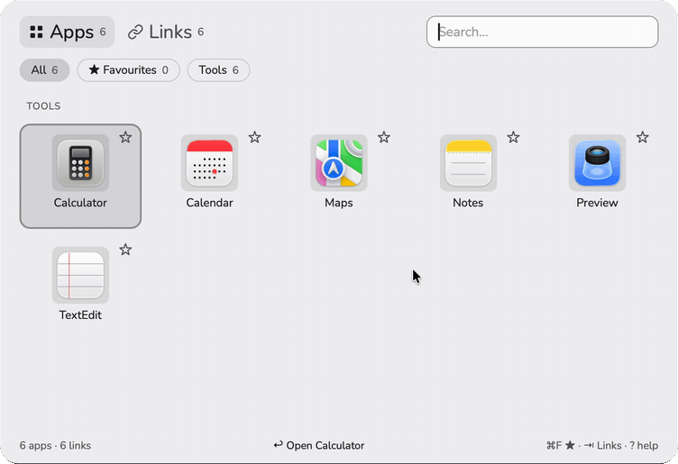

<p align="center"></p>

<h1 align="center">hopto</h1>

<p align="center">
  <a href="https://github.com/drolosoft/hopto/releases/latest"></a>
  <a href="https://opensource.org/licenses/MIT"></a>
  <a href="https://github.com/drolosoft/hopto/releases/latest"></a>
</p>

> **⌨️⚡🔗 Keyboard launcher for your macOS apps and links. One shortcut, type, Enter.**

⌘⇧Space opens your apps, ⌘⌥Space your links. Type a few letters, press Enter, and the panel is gone. Your links live in one TOML file you can read, edit and keep in git.

<p align="center"></p>

---

### Why

| | The usual way | hopto |
|---|---|---|
| 🔀 | Spotlight mixes apps, files, mail and web results in one list | Apps on one shortcut, links on another, and each list holds only what you installed or saved |
| 🔗 | Bookmarks live inside one browser and open with the mouse | Links open from any app in your default browser; ⌘↩ sends one to a second browser |
| 📄 | A launcher's settings sit in a database you cannot read | One `library.toml` you can edit by hand, back up and keep under version control |
| 🐢 | A page you open once a month means typing half its address | Search by name, host, keywords and description; what you open most comes first |

---

### Features

<table>
<tr>
<td width="50%" valign="top">

**⌨️ Two shortcuts, one panel**<br>
⌘⇧Space for apps, ⌘⌥Space for links. The same shortcut again hides the panel; the other one switches tab.

**🔍 One search for both**<br>
Typing searches apps and links together, by name, host, keywords and description, ignoring accents and case.

**🧭 Apps found for you**<br>
Everything in /Applications and ~/Applications, the apps of /System/Applications as you type, and the web apps installed from Microsoft Edge.

**🔗 Links with categories**<br>
A chip for each category, a favourites chip, and the items you open most at the top.

**＋ Add by typing**<br>
Type an address that is not there and press Enter: the editor fills in the page's name, description and icon.

**📦 Apps by hand**<br>
⌘N on the apps tab opens the native file dialog. ⌘⌫ hides a found app, and its chip brings it back.

</td>
<td width="50%" valign="top">

**📄 A file you own**<br>
`library.toml` is read again every time the panel opens and never overwritten when it cannot be parsed.

**🖼️ Icons that stay**<br>
Fetched once from the site itself or a selfh.st hint and kept as files, through a client that refuses private addresses.

**🧷 Menu bar item**<br>
Open, Help, Edit library.toml, Open at login and Quit.

**👋 Welcome**<br>
The first run lists the shortcuts and says whether macOS keeps one of them for itself.

**🌗 Light and dark, English and Spanish**<br>
Follows the system's theme and language, or the settings.

**🪶 Out of the way**<br>
No Dock icon, no window until you call it, one small app.

</td>
</tr>
</table>

---

### Quick Start

1. Download `hopto-<version>-macos-universal.zip` from the [latest release](https://github.com/drolosoft/hopto/releases/latest). The same app runs on Apple silicon and Intel Macs, macOS 12 or later.
2. Open the zip and move `hopto.app` to `/Applications`.
3. hopto is not signed with an Apple Developer ID yet, so macOS refuses the first open. Clear the download flag once:

   ```sh
   xattr -dr com.apple.quarantine /Applications/hopto.app
   open /Applications/hopto.app
   ```

   Or open it, close the warning, and click **Open Anyway** in System Settings › Privacy & Security.
4. Press **⌘⇧Space**. The welcome panel lists both shortcuts and whether each one is ready.

To start hopto at login, tick **Open at login** in its menu bar item.

**Build from source** (Go 1.27, Node 22, the Xcode Command Line Tools):

```sh
go install github.com/wailsapp/wails/v2/cmd/wails@v2.16.0
git clone https://github.com/drolosoft/hopto.git
cd hopto
make build
open build/bin/hopto.app
```

---

### Configure

Everything lives in `~/Library/Application Support/hopto/library.toml`. The first run writes a small library there; **Edit library.toml** in the menu bar item opens it.

```toml
[settings]
hotkey_apps = "cmd+shift+space"
hotkey_links = "cmd+option+space"
secondary_browser = "com.apple.Safari"

[[categories]]
id = "docs"
name = "Documentation"
tab = "links"

[[links]]
id = "mdn"
name = "MDN"
description = "Web platform reference"
url = "https://developer.mozilla.org"
category = "docs"
keywords = ["html", "css"]
icon = "sh:mozilla"
```

- hopto reads the file again every time the panel opens, so a hand edit shows up at once. The shortcuts are read at start: quit from the menu bar item and open hopto again after changing them.
- A file with a mistake is never overwritten. The panel shows the line with a button that opens the file, and adding or editing waits until it parses again. The previous good file is `library.toml.bak`.
- Comments you add by hand are lost the next time hopto saves the file.
- [config.example.toml](config.example.toml) explains every setting in place, and [doc/configuration.md](doc/configuration.md) lists every key.

---

### Keyboard

| Anywhere | |
|---|---|
| ⌘⇧Space | Show the apps tab; on it, hide the panel |
| ⌘⌥Space | Show the links tab; on it, hide the panel |

| In the panel | |
|---|---|
| ↑ ↓ ← → | Move the selection |
| ↩ | Open the app or the link |
| ⌘↩ | Open a link in the secondary browser, or an Edge web app as a page |
| ⌥↩ | Show an app in the Finder |
| ⌘⇧↩ | Open every item of the selected chip, up to 10 |
| ⌘C | Copy the URL or the path |
| ⌘F | Add to favourites, or remove |
| ⌘1 … ⌘9 | Pick a chip while the search box is empty (⌘1 is All) |
| ⇥ | Other tab |
| ⌘N | New link, or new app on the apps tab |
| ⌘E | Edit the selected item (or click the pencil that appears on an item under the pointer) |
| ⌘⌫ | Delete a link or an app added by hand, hide a found app, or show a hidden one again (asks first: ↩ yes, Esc no) |
| ⌘⇧E | Rename the selected chip |
| ⌘⇧⌫ | Delete the selected chip once it is empty |
| Esc | Clear the search, then hide |
| ? or ⌘/ | Show the shortcuts |

| In the editor | |
|---|---|
| ↩ | Save |
| Esc | Cancel |
| ⌘1 … ⌘9, or ← → on the chips | Pick the category |
| ⌘O | Choose the .app (apps) |
| ⌘E | Edit the item you already have, when the editor says so |

---

### How It Works

- hopto is a Go program with a [Wails](https://wails.io) window. The panel is a web page in a WKWebView; the library, the scans, the icons and everything native are Go.
- The shortcuts are registered with Carbon's `RegisterEventHotKey`: global, no Accessibility permission, and they work while the panel is hidden.
- hopto runs as an accessory app: no Dock icon, no place in ⌘⇥. The panel comes back on the display it was last on, in every Space and over full-screen apps.
- `library.toml` is read again on every open and written atomically, with the last good version kept aside. A file that does not parse is never overwritten.
- Icons are fetched once through a client that allows only https, gives up after 10 seconds, reads at most 512 KiB and refuses private addresses; every image is decoded and written again as a PNG before the page shows it.
- The page sends Go ids, never URLs or paths. Apps open with `open`, like a double click in the Finder; links in your default browser.
- Nothing leaves your Mac except the icon downloads and the reading of a page whose address you type in the editor. No account, no telemetry.

More in [ARCHITECTURE.md](ARCHITECTURE.md) and [doc/architecture.md](doc/architecture.md).

---

### Documentation

| | |
|---|---|
| [Architecture](doc/architecture.md) | How the window, the shortcuts, the scans and the icons work on macOS |
| [Configuration](doc/configuration.md) | Every key of library.toml, and what happens when the file is refused |
| [Testing](doc/testing.md) | The test suites, and how to drive the real app from the shell |
| [ARCHITECTURE.md](ARCHITECTURE.md) | Flows, packages, design decisions and known limitations |
| [CHANGELOG.md](CHANGELOG.md) | What changed in each release |
| [CONTRIBUTING.md](CONTRIBUTING.md) | Setting up, code style, tests and pull requests |

---

### Building

| Command | What it does |
|---|---|
| `make build` | `build/bin/hopto.app`, stamped with the version, the commit and the date |
| `make test` | Page unit tests, `go vet`, Go tests with the race detector |
| `make e2e` | Browser tests in WebKit against the built page (after `make build`) |
| `make lint` | `gofmt` and `golangci-lint` |
| `make dist` | The release zip, `build/dist/hopto-<version>-macos-universal.zip`, and its SHA-256 |
| `make hooks` | Installs the pre-commit guard against internal files |
| `make clean` | Removes the build output |

Requires macOS 12 or later, Go 1.27, Node 22, the Wails CLI v2.16.0 and the Xcode Command Line Tools.

---

### Troubleshooting

**⌘⌥Space opens "Searching This Mac".** macOS uses ⌘⌥Space for "Show Finder search window". Turn it off in System Settings › Keyboard › Keyboard Shortcuts › Spotlight, or pick another shortcut in `hotkey_links`. The welcome panel warns about it and opens that page for you.

**"hopto" cannot be opened, or Apple could not verify it.** The release is not signed yet; see step 3 of the Quick Start.

**There is no Dock icon.** By design. Use the shortcuts, or the menu bar item, which also has Quit.

**Open at login does nothing.** hopto refuses to write the LaunchAgent while it runs from a translocated copy, the state macOS gives a fresh download opened without being moved first. Move hopto.app to /Applications, open it again, then tick the box.

**A shortcut does nothing.** Another app may have it. The welcome panel and `~/Library/Logs/hopto.log` say whether each one registered (`hotkey 1 registered`, or `RegisterEventHotKey failed` with a status). Pick another in `library.toml`, then quit hopto from the menu bar item and open it again.

**A line at the top of the panel says `library.toml, line N: …`.** The file does not parse or breaks a rule. hopto keeps showing the last good library and refuses to write until that line is fixed; the button opens the file. The previous good version is `library.toml.bak`.

**Some links have no icon.** The site offers none that hopto can use. Add `icon = "sh:<name>"` from [selfh.st/icons](https://selfh.st/icons) or an https image URL to the link, or add `duckduckgo` or `google` to `icon_services`.

---

### Contributing

Bug fixes, translations and ideas are welcome. Read [CONTRIBUTING.md](CONTRIBUTING.md), then open an issue or a pull request.

If hopto saves you a few seconds a day, a ⭐ helps others find it.

### Support

<p align="center"><a href="https://buymeacoffee.com/juan.andres.morenorub.io"></a></p>

### License & Philosophy

MIT, see [LICENSE](LICENSE). hopto gets you to an app or a page in two keys and then gets out of the way. Your library is a plain file on your Mac, readable without hopto; there is no account, no telemetry and no update check.

---

**MIT License** · **Forged by [Drolosoft](https://drolosoft.com)** · *Tools we wish existed*
